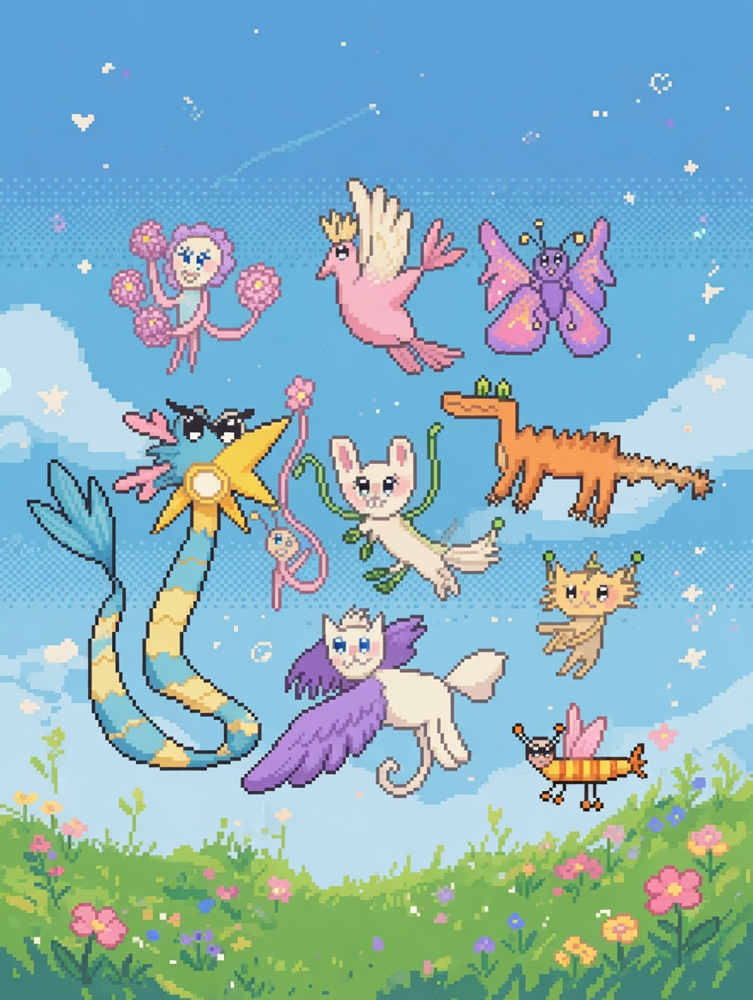

# aura-pets



> **Aura-powered virtual pet raising game.** Pets evolve their own behaviors and personalities through self-mutating code.

A playful experimental project exploring how [Aura](https://github.com/cybrid-systems/aura) — the AI-native Lisp programming language with auto-mutating ASTs — can create living, adaptive virtual pets.

## ✨ What Makes It Special

- **Self-evolving pets**: Pet logic, responses, and even "personalities" are written in Aura and can **mutate** over time based on player interaction.
- **Classic pet养成 with a twist**: Feed, play, train, and care for your pet — then watch it genuinely surprise you as its code evolves.
- **Showcase of Aura's capabilities**: Demonstrates dynamic code modification, reflection, incremental compilation, and agent-like behavior in an interactive game context.
- Part of the **cybrid-systems** ecosystem.

## Planned Features

- Multiple pet species with different base traits
- Visual evolution (appearance + behavior changes)
- Training & interaction systems that trigger code mutations
- Persistent saves with evolution history ("pet soul" versioning)
- Simple UI (web or desktop, TBD)
- Optional AI co-pilot that helps evolve pets

## How Pets Evolve

Each pet’s core behavior is expressed as Aura code. Using Aura’s powerful primitives (`query:*`, `mutate:*`, `eval-current`), the game can:

- Inspect current pet logic at runtime
- Mutate specific functions or behavior trees based on care, training, or random growth events
- Hot-reload evolved logic without restarting the game

This creates pets that feel truly **alive** and capable of surprising development.

## Getting Started

```bash
git clone https://github.com/cybrid-systems/aura-pets.git
cd aura-pets

# Build & run instructions will be added once the prototype is ready
```

## Project Structure (Planned)

```
aura-pets/
├── src/
│   ├── pet/           # Pet state, evolution engine
│   ├── aura/          # Aura runtime integration & primitives
│   └── ui/            # Rendering and input handling
├── assets/            # Sprites, animations, sounds
├── examples/          # Example pet definitions written in Aura
├── docs/              # Design notes & Aura usage examples
└── README.md
```

## Current Status

🚧 **Early planning & prototype stage** (Summer 2026 experimental project)

## Roadmap

- [ ] Core Aura integration for pet behavior
- [ ] Basic raising loop (feed / play / train / rest)
- [ ] Mutation & evolution system
- [ ] Visual pet representation
- [ ] Save / load with evolution log
- [ ] Playable demo release

## Contributing

This is currently a personal/experimental project. Feedback, ideas, and contributions are very welcome once it opens up!

## License

Apache-2.0 License (same as Aura)

---

**Built with glowing particles and a lot of curiosity.**

<!-- 
Banner image prompt (if you want to regenerate):
Cute whimsical cartoon virtual pet creature with a soft glowing magical aura around it, friendly big eyes, floating slightly, pastel soft colors background with subtle light particles, clean illustration style suitable for a GitHub README header banner, high quality, charming and inviting atmosphere
-->
